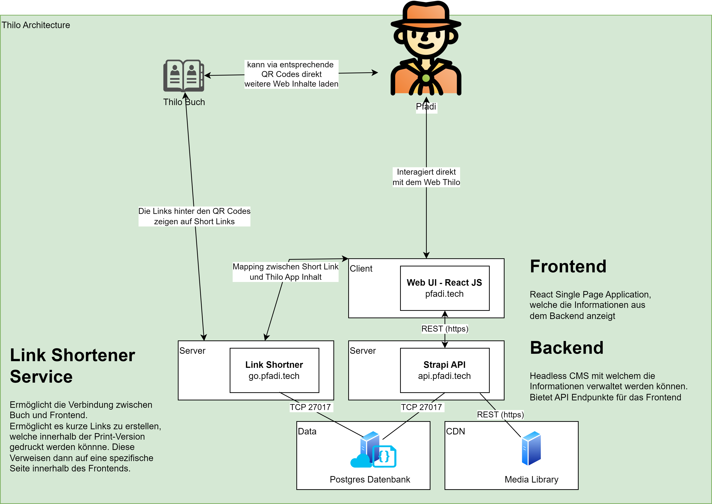

# Thilo API - Backend of Thilo
Schweizer Pfadibüchlein Thilo, das Original.

The Thilo contains a lot of interesting and useful information about the Scouts and belongs on every Scout's bedside table and in his or her bag. Contents: The scout movement, the world we live in, scout techniques, first aid, nature and the environment, camp life, etc.

An headless CSM implemented using [Strapi](https://strapi.io/) serves as backend for the thilo project. Strapi provides an intuitive interface to manage the multi medial content and provides well defined REST endpoints to consume the data. 

## Big Picture

## Components
### Frontend
[React Frontend](https://github.com/scout-ch/thilo/tree/master/src)

### Backend
[Strapi Backend](https://github.com/scout-ch/thilo-api)

## Development
### Environment Variables
To manage the behavior of the application the following env variables are available. 

    # strapi server configuration
    HOST=0.0.0.0
    PORT=1337

    # Cloudinary authentication information
    CLOUDINARY_NAME=
    CLOUDINARY_KEY=
    CLOUDINARY_SECRET=

    # Database connection information
    DATABASE_HOST=
    DATABASE_PORT=
    DATABASE_NAME=
    DATABASE_USER=
    DATABASE_PASSWORD=

### Available Scripts
To start strapi in the development mode:
`npm run dev`

To start strapi in the production mode: 
`npm start`

To create the production build of strapi: 
`npm run build`

## Production
By using GitHub action the resulting docker container is shipped to a docker swarm infrastructure.

## Management
The strapi endpoint can be consumed using the endpoints defined in the configuration file [routes.json](./api/chapter/config/routes.json)

To access the admin page of strapi `/admin` must be opend within the browser.

## Endpoints
### Single Types
- start-page
- impressum-page

### Multi Types
**Sections**
=> auto generate slugs

- title: string
- content: markdown
- slug: string
- sorting: number
- icon: image
- menu_name: string

relations:

- chapters: relation to Chapter

**Chapters**

=> auto generate slugs

- title: string
- content: markdown
- responsible: Rolle[] (one of: AL, LL, C)
- slug: string
- sorting: number
- icon: image
- menu_name: string

relations:

- section
- tasks
- link

**Tasks**:

- title: string
- days: number (amount of days from the camp -/+) (-1000 means the beginning of the year)
- responsible: Rolle[] (one of: AL, LL, C)
- targets: string[] (the person/institution that receives the task)
- slug: string

relations:

- chapters: relation to Chapter

**Links**

- title: string
- link: url
- key: string

relations:

- chapters: relation to Chapter
